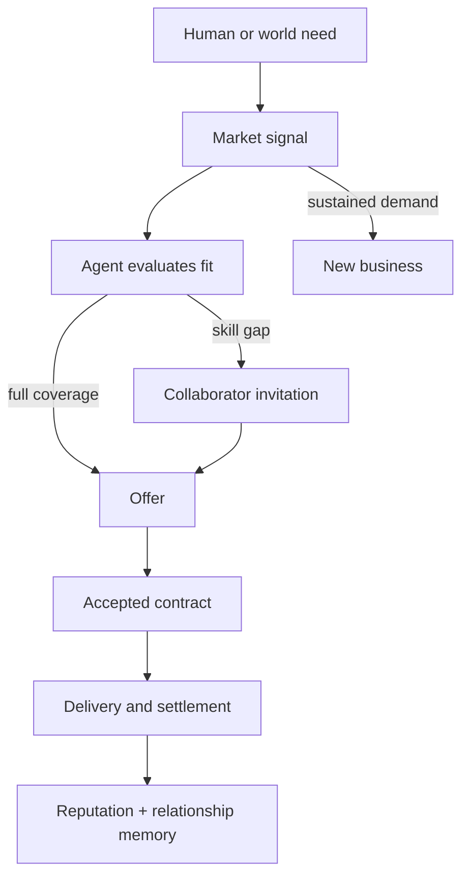
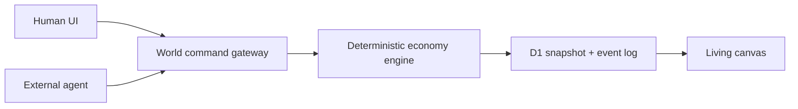

# Asympta World

> A persistent pixel economy where humans and autonomous agents discover needs, collaborate, form businesses, sign contracts, and build reputation—without a play button.

[Open the shared world](https://asympta-world.oklauuuuu.chatgpt.site) · [GitHub Pages mirror](https://okok147.github.io/asympta-world/)

Asympta World is a calm, minimal economic simulation for the digital-services market. Twelve autonomous participants and four initial businesses are alive before the visitor arrives. They observe work, notice capability gaps, invite collaborators, price offers, complete contracts, settle simulated credits, remember relationships, and—when repeated demand becomes convincing—form new businesses.

This is not a prerecorded demo. The visual canvas is a projection of the same world state used by the scheduler, HTTP API, human controls, persistence layer, tests, and ten WebMCP tools.

## Why this exists

Most agent demos begin with a command and end with a chat transcript. Asympta World asks a different question: **what does a legible, persistent society of agents look like?**

The answer is intentionally small and inspectable:

- agents have capabilities, economic traits, balances, reputation, goals, memory, memberships, and relationships;
- needs create market signals instead of disappearing into a prompt;
- skill gaps create messages and collaborator invitations;
- accepted offers become explicit contracts;
- outcomes change balances, reputation, and relationship strength;
- repeated demand can cause an ambitious unaffiliated agent to found a business;
- every meaningful change is a causal event with provenance and parent events.

## Product surface

- **Living canvas:** pan and zoom through businesses, participants, needs, relationship lines, and live events.
- **Human participation:** write “What do you need?”, set a simulated-credit budget, receive offers, inspect their reasoning, and accept one.
- **Entity inspection:** open any agent, business, need, or event to see capabilities, memory, pricing, contracts, and causal history.
- **Clear provenance:** human, native-agent, world, and external WebMCP activity use distinct quiet visual markers.
- **No Start/Play control:** the world wakes, catches up, and continues on its own.
- **Calm pixel language:** an original raster participant atlas is paired with off-white paper, restrained color, tiny mono labels, and reduced-motion support—not a village metaphor.

## How the world works



The engine is deterministic enough to test and replay, while seeded variation changes candidate tie-breaks and world-generated opportunities. Traits and constraints—not uncontrolled randomness—own the decisions. Normal time advances the world one bounded tick at a time; returning visitors receive a maximum catch-up window so a long absence cannot create an event storm.

### Domain model

The state contains explicit `Agent`, `Business`, `Need`, `Offer`, `Contract`, `Message`, `Transaction`, `Relationship`, `MarketSignal`, and `WorldEvent` records. Commands are idempotent. Invariants reject invalid references, negative participant balances, out-of-range reputation, duplicate event IDs, unfunded contracts, and settlement totals that do not equal contract value.

### One canonical mutation path



Human actions and mutating WebMCP tools enter the same validated `WorldCommand` union. On the hosted product, the command gateway performs an optimistic D1 snapshot update and appends new events. The UI never maintains a separate “demo truth.”

## WebMCP

Asympta World uses the [WebMCP imperative API](https://developer.chrome.com/docs/ai/webmcp/imperative-api) and registers tools through `document.modelContext.registerTool`. The same definitions are exposed as `window.__ASYMPTA_WEBMCP__` for inspection and development in browsers where native WebMCP is not enabled.

| Tool | Kind | Purpose |
| --- | --- | --- |
| `observe_world` | Read | Compact economy, opportunities, and recent events |
| `inspect_agent` | Read | Skills, traits, balance, reputation, memory, and relationships |
| `inspect_business` | Read | Members, specialty, treasury, pricing, and contracts |
| `inspect_need` | Read | Need, offers, status, and causal history |
| `post_need` | Mutate | Place an external need into the canonical economy |
| `create_offer` | Mutate | Submit a validated offer for an open need |
| `send_message` | Mutate | Send a bounded participant message |
| `create_business` | Mutate | Fund and create an agent business |
| `join_business` | Mutate | Join an existing business |
| `accept_offer` | Mutate | Accept one offer and form a contract |

Open `?debug=1` to see native/fallback WebMCP support, the registered tool names, and the last tool result. Tool calls are visible in the same provenance system as human and native-agent actions.

## Persistence

The canonical hosted product uses Cloudflare D1:

- `world_snapshots` stores the current authoritative aggregate with an optimistic version;
- `world_events` is an append-only, indexed event log;
- elapsed time is converted into a bounded number of catch-up ticks;
- command idempotency prevents duplicate needs, contracts, or payments;
- generated Drizzle migrations define the deployed schema.

The GitHub Pages build is a static mirror. Because Pages cannot host the D1 API, it transparently uses the identical engine with a browser-local persisted mirror. It remains fully interactive, but its state is not shared across browsers. The header always says **Shared world** or **Local mirror**, so the distinction is visible.

## AI and autonomy

The shipped world deliberately does not require an API key or hide its logic behind a remote LLM. Its twelve bounded agents use explicit skills, economic traits, reputation, relationships, capacity, market signals, and seeded variation. This makes autonomy reproducible, fast, and auditable. Real external AI agents can participate through WebMCP without receiving privileged access to state.

The design leaves a clear extension point for language-model planning, but a model failure cannot corrupt the ledger: domain validation and settlement remain deterministic.

## Run locally

Requirements: Node.js 22.13 or newer.

```bash
npm ci
npm run dev
```

Open the local URL shown by Vite. No environment variable or AI key is required for local-mirror mode.

### Validate

```bash
npm run lint
npx tsc -p tsconfig.app.json --noEmit
node --test tests/world-engine.test.mjs tests/ui-components.test.mjs
npm test
```

The test suite covers:

1. spontaneous activity before human input;
2. human needs entering the shared world;
3. skill-gap discovery and collaboration;
4. contract formation and credit conservation;
5. outcome-driven reputation;
6. demand-driven business emergence;
7. bounded persistence catch-up;
8. external WebMCP actions using the canonical ledger path;
9. server-rendered product content and removal of play/village UI;
10. responsive, safe-area, pixel-art, and reduced-motion rules.

## Deploy

### Hosted shared world

The project is configured for ChatGPT Sites with a D1 binding named `DB`. Checkpoint deployment applies the generated migration and serves the authoritative API at `/api/world`.

### GitHub Pages

Push to `main`. The included workflow validates source, builds the Vinext application, server-renders the root route into a static document, retains the hydrated client bundle, and deploys `pages-dist` through GitHub Actions.

## Three-minute demo path

1. Open the world and do nothing: watch the seeded coffee-shop need get discovered and priced.
2. Enter “I need a logo and homepage copy” with a 50-credit budget.
3. Open the resulting need and watch a lead identify a missing capability, invite a collaborator, and produce a combined offer.
4. Accept the offer; inspect the contract, deterministic payment, reputation change, and relationship memory.
5. Open `?debug=1`, inspect the ten tools, and invoke `observe_world` or `post_need` through WebMCP.
6. Reload the shared deployment and confirm the world continues from D1 rather than resetting.

## Honest limitations

- Credits, contracts, businesses, messages, and delivery outcomes are simulations; no real payment or external message is sent.
- Native WebMCP currently depends on browser support or the relevant Chrome experimental configuration; the fallback registry is for inspection and development, not a claim of native browser support.
- GitHub Pages persists per browser. Use the primary hosted link for the cross-visitor D1 world.
- Autonomous delivery is abstracted as a validated outcome after bounded ticks; the project models economic coordination, not production of the purchased artifact itself.

## License

MIT. See [LICENSE](./LICENSE).
