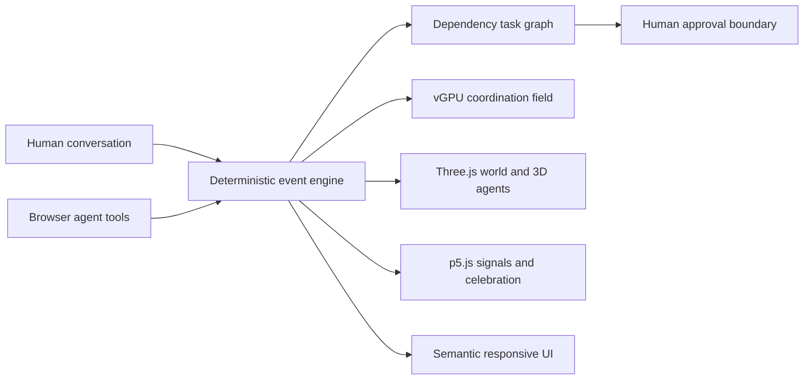

# Asympta World

> Humans live. Agents coordinate the world around them.

[Live demo](https://okok147.github.io/asympta-world/) · [Dinner demo](https://okok147.github.io/asympta-world/?demo=dinner) · [WebMCP Challenge](https://webmcp.devpost.com/)

Asympta World is a human-centred coordination world for people and browser agents. A person states one ordinary need—find dinner, prepare a meeting, compare a product, or handle an email—and a small team of specialised animal agents turns it into an inspectable task graph. They move through a shared spatial world, call clearly labelled services, exchange information, converge on one useful outcome, and stop for the human before any consequential action.

The product is intentionally calm. The conversation field is always available, every action is reachable by typing `/`, English is the default, 繁中 is one tap away, and the same experience reflows from a 320 px phone to a wide desktop.

## Judge path: 45 seconds

1. Open the [Dinner demo](https://okok147.github.io/asympta-world/?demo=dinner), or type `/dinner` in the conversation field.
2. Watch five genuinely different animal agents divide a dependency-based task graph and exchange visible information.
3. Open **WebMCP** and invoke **Observe coordination**, **List local services**, or **Exchange information**.
4. At the result, choose **Reserve table**. The world stops at a human approval boundary; approving records a demo handoff and explicitly confirms that nothing was booked.
5. Resize to phone width, type `/`, and switch to 繁中 from the menu. The composer and all critical actions remain on screen.

## Why WebMCP

Ordinary life tasks span context, specialised work, services, and judgment. A browser agent should not have to reverse-engineer visual controls or silently act on consequential choices. Asympta exposes the same event-driven world used by the human interface through five narrow imperative WebMCP tools.

| Tool | Kind | What it enables |
| --- | --- | --- |
| `asympta_observe_coordination` | Read | Inspect the need, local world, team, task graph, information exchange, service modes, result, and approval state. |
| `asympta_list_local_services` | Read | Discover only services relevant to the current need, including LIVE / DEMO / SIMULATED provenance. |
| `asympta_submit_need` | Write | Classify a natural-language need and activate a bounded useful team. |
| `asympta_exchange_information` | Write | Send a visible, length-bounded packet between two active agents. |
| `asympta_request_action` | Write | Request a valid result action; consequential actions transition to `waiting_for_human`. |

Tools are registered with `document.modelContext.registerTool(...)`, JSON Schema inputs, lifecycle cancellation, `readOnlyHint`, and `untrustedContentHint`. In browsers without native WebMCP, the identical definitions remain callable through the in-product bridge at `window.__ASYMPTA_WORLD__`; the UI labels this as a compatible fallback rather than claiming native support.

## One state, four complementary views



- **[vGPU](https://vgpu.sh/)** renders one subtle, state-reactive WebGPU coordination field on capable desktops. It is idle-loaded, fixed at DPR 1 and 12 fps, and paused while the page is hidden.
- **Three.js** renders the low-poly local world, buildings, roads, service zones, camera follow, and lightweight 3D animal presences with a low-power renderer.
- **p5.js** renders active-service pulses, travelling information packets, and completion particles. Its fallback ambient particles switch off whenever vGPU is active, avoiding duplicated GPU work.

All three canvas engines share a performance gate. They are idle-loaded only on sufficiently large, capable screens and omitted on small/short screens, reduced-motion, save-data, or low-memory devices. The semantic map, distinct SVG animals, task state, controls, approval and completion feedback remain complete without downloading those progressive chunks.
- **Semantic React UI** keeps every important label, agent, menu, result, and approval action keyboard- and screen-reader-accessible. Canvas is enhancement, never the only control surface.

The engine is deterministic and event-driven, not a prerecorded animation. `render_game_to_text()` exposes the current spatial/task state for automated inspection, and `advanceTime(ms)` advances the same state machine used by the live UI.

## Four complete scenarios

| Need | Useful team | Services | Human outcome |
| --- | --- | --- | --- |
| Dinner | Peacock, Otter, Fox, Owl, Turtle | Local context, place search, preference, travel | One practical dinner choice; booking requires approval. |
| Work | Elephant, Deer, Raven, Beaver | Calendar, research, documents | A concise meeting brief; sharing requires approval. |
| Shopping | Crane, Meerkat, Lynx, Raccoon | Requirements, products, price | A legible comparison; buying requires approval. |
| Email | Orca, Hummingbird, Rabbit, Red panda | Inbox, context, drafting | A held reply draft; sending requires approval. |

All 17 agents use different species and different art directions. Only the team useful to the current need appears.

## Location without surveillance

With permission, `watchPosition` follows the device at low accuracy. Coordinates are immediately converted into a stable nearby cell and a 5×5 community group with a system-generated poetic name such as **Moonlit Commons · Cloud Lane**. Exact coordinates are never displayed or placed in WebMCP output. Denial and unavailability are explicit states; the product falls back to a labelled demo area instead of fabricating live location.

## Trust boundaries

- Every adapter discloses `live`, `demo`, or `simulated` mode.
- Browser-agent tool inputs are schema-bounded and validated against current world state.
- Read tools are annotated read-only; mutating or user/external-content tools are marked untrusted.
- Booking, buying, sharing, and sending always require a visible human approval step.
- The current demo has no live external connector, so approval records a handoff and never falsely claims a booking, purchase, share, or send occurred.
- Reduced-motion users receive static visual state rather than continuous movement.

## Run locally

Requirements: Node.js 22.13 or newer.

```bash
npm ci
npm run dev
```

Open the local URL printed by Vite. No account, API key, or secret is required.

For native WebMCP testing in Chrome 149 or later, enable `chrome://flags/#enable-webmcp-testing`, relaunch Chrome, and inspect the five registered tools. ChatGPT's in-app browser can also discover the tools on a deployed build.

## Verify

```bash
npm run lint
npm run typecheck
npm run test:engine
npm run build
npm run test:rendered
npm run export:pages
```

The automated suite covers task dependencies, deterministic replay, tool provenance, information exchange, safe and consequential result paths, approval decline/acceptance, geolocation grouping, 17 distinct characters, bilingual and slash-command source contracts, the vGPU/Three.js/p5.js layers, their performance gates, responsive/reduced-motion rules, and server-rendered product content. Browser QA additionally exercises native registration with a WebMCP mock, progressive canvas rendering, keyboard commands, geolocation updates, portrait screens from 280×480 to 1440×900, and short landscape screens down to 568×320.

## Challenge fit

- **WebMCP leverage:** five non-trivial tools change and inspect one canonical event world; agent-to-agent exchange and approval are visible to the person.
- **Execution:** complete end-to-end scenarios, responsive product UI, accessibility, privacy, error handling, deterministic tests, and deploy automation.
- **Potential impact:** reduces the coordination burden of everyday multi-step needs without asking a human to supervise every subtask.
- **Creativity and ambition:** a spatial, location-aware society where browser agents collaborate around human life instead of replacing it with another chat transcript.

Submission-ready copy, testing instructions, and the under-three-minute video storyboard are in [docs/WEBMCP_CHALLENGE_SUBMISSION.md](./docs/WEBMCP_CHALLENGE_SUBMISSION.md).

## Honest limitations

- Restaurant, calendar, document, product, inbox, price, and availability data are simulated and clearly labelled.
- Native WebMCP depends on a supporting browser or enabled Chrome experiment; the in-product bridge is a faithful development fallback, not a native-support claim.
- Location grouping is local browser state; there is no account or cross-device profile.
- vGPU, Three.js, and p5.js are progressive visual enhancements. Core actions and the DOM world remain usable if the performance gate skips them or any canvas cannot render.

## License

MIT. See [LICENSE](./LICENSE).
